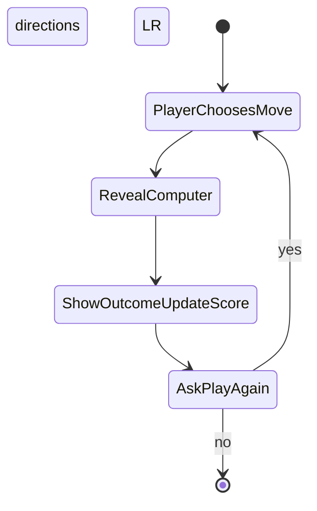

# Rock Paper Scissors — Web frontend (intent)

## Purpose & stack

This folder is for a browser-based Rock Paper Scissors experience: **pure HTML, CSS, and JavaScript** at the project root (`index.html`, `style.css`, `script.js`)—no bundler or framework unless this document deliberately says otherwise.

## Play live

**Stable site (GitHub Pages):** [https://zhoulinhua0-star.github.io/rock-paper-scissors-game-java/](https://zhoulinhua0-star.github.io/rock-paper-scissors-game-java/) — open in any modern browser; no install. This URL tracks the `main` branch via the repo’s **Deploy web game to GitHub Pages** workflow.

**First-time setup:** In the GitHub repo, go to **Settings → Pages → Build and deployment**, set **Source** to **GitHub Actions** (not “Deploy from a branch”). Push to `main` (or run the workflow manually) and wait for the green check; the link above will serve the files from this folder.

## Relationship to the Java console game

The reference implementation is the console program in this same repository (`src/rockPaperScissors/RpsGame.java`). This web version is its **spiritual successor**: same fairness and scoring rules unless a future change is written down here first.

## Gameplay parity (must match Java)

- Player chooses rock, paper, or scissors (the console used `r` / `p` / `s`; the UI may use buttons, icons, or keys, but outcomes stay the same).
- The computer picks uniformly at random among the three moves.
- **Scoring** (running total across the session):
  - **Tie** → +1
  - **Win** → +2
  - **Loss** → −1
- After each round, the player can **play again** or stop; show a clear goodbye and the **final total score** when the session ends.

## Intriguing frontend goals

Treat the README as **product narrative + parity + blueprint**. The concrete UX and atmosphere live in **Design blueprint** below; implementation should reward attention without violating accessibility or readability.

## Planned file layout

```
rock-paper-scissors-web/
├── README.md
├── .cursor/
│   └── rules/
│       └── rock-paper-scissors-web.mdc
├── index.html
├── style.css
└── script.js
```

`index.html`, `style.css`, and `script.js` are wired up in this folder alongside the blueprint above.

---

## Design blueprint

### Creative direction

Think **late-night duel at a luminous counter**: a dark-friendly base, restrained neon or accent color, generous breathing room, and type that stays legible under excitement. Optionally suggest paper or tabletop texture—but **never at the cost of WCAG-aligned contrast**. “Intriguing” here means deliberate mood plus clarity, not decoration that obscures outcomes.

### Player journeys (scenarios)

- **First visit:** The headline explains the duel in one line; moves are obviously tappable or focusable; a tiny hint exposes keyboard shortcuts so power users discover them without clutter.
- **Mid-session:** Score and last result stay anchored so the eyes know where to land after every reveal.
- **After a loss:** The tone is rueful but fair—readable outcome text and a cue to try again—without mocking the player.
- **End of session:** Quitting lands on an unmistakable farewell with **final total score**, matching the console game’s parting ritual.

### Screens and game states

Everything lives on **one page** with a compact state progression that mirrors Java’s loop:

Choosing (idle or selecting) → **locked player choice** → **reveal** (show both picks) → **outcome messaging** → **score update** → prompt **Play again / Quit**.

No rule changes versus Java—only how the stages are surfaced in the UI.

### Moments that feel rewarding

- A short **pause or beat** before the computer’s move appears, enough to sell tension—not long enough to feel sluggish on repeat rounds.
- **Strong typographic treatment** for WIN / TIE / LOSE messages so emotion lands instantly.
- A humane moment when **score catches up mentally**—e.g., let the headline land, then reinforce the numeric total so the adjustment feels deliberate.
- **Light motion vocabulary** expressed only as intent: soften a tie with a restrained shake or pulse; let a win read as upward energy; acknowledge a loss with a subdued emphasis—always optional and never required for comprehension.

### Controls

- **Pointer:** Three clear move controls (labels always visible beside any icon shorthand).
- **Keyboard contract:** **`R`** rock, **`P`** paper, **`S`** scissors when focus is sensible (document any requirement for focusing the arena first); **`Enter`** or **`Y`** confirms **Play again**; **`N`** or **`Escape`** confirms **Quit** / end session. Adjust only if parity with this contract is preserved in README when you iterate.

Information about these shortcuts stays visible enough for discovery (inline hint or compact legend).

### Information always visible

- **Running session score**
- **Last round:** player choice, computer choice, and textual outcome consistent with parity rules

### Accessibility targets

- **Focus order** follows the mental play sequence (pick move → acknowledge result → confirm next action).
- **Live region (`aria-live`)** with **polite** updates for round summaries so assistive-tech users hear what sighted players read.
- Icons or glyphs remain **paired with readable text**, not lone mystery symbols.

### Implementation shape — JavaScript (ideas only)

Responsibilities, not implementations:

- `pickComputerMove` — unbiased choice among rock, paper, scissors.
- `judgeRound(player, computer)` — returns win / lose / tie.
- `scoreFromOutcome(outcome)` — tie +1, win +2, loss −1.
- Minimal session memory (at least **`score`**).
- A thin shell that translates state into DOM updates **after** the pure logic resolves the round—keeps parity testable by reading functions in isolation.

### Implementation shape — CSS (ideas only)

- **Arena layout:** centered column with a sensible max-width; stacks vertically on narrow viewports instead of cramming horizontally.
- **Tokens as a future habit:** conceptual spacing ladder, radius family, elevation/shadow vocabulary, semantic color roles (surface, foreground, accent, danger/success neutrality)—implemented later as **CSS custom properties** rather than scattering magic literals everywhere.

### Flow (mental model)



### What we deliberately avoid

Servers, persistence beyond the tab session as a baseline, leaderboard databases, build pipelines, SPA frameworks—**unless README is amended on purpose.** Curiosity stays inside three static files unless you widen scope consciously.

### Optional assets later

If you crave extra intrigue without exploding scope: **simple SVG silhouettes** or **Unicode glyphs** for the three shapes, keeping **animations CSS-first.**
